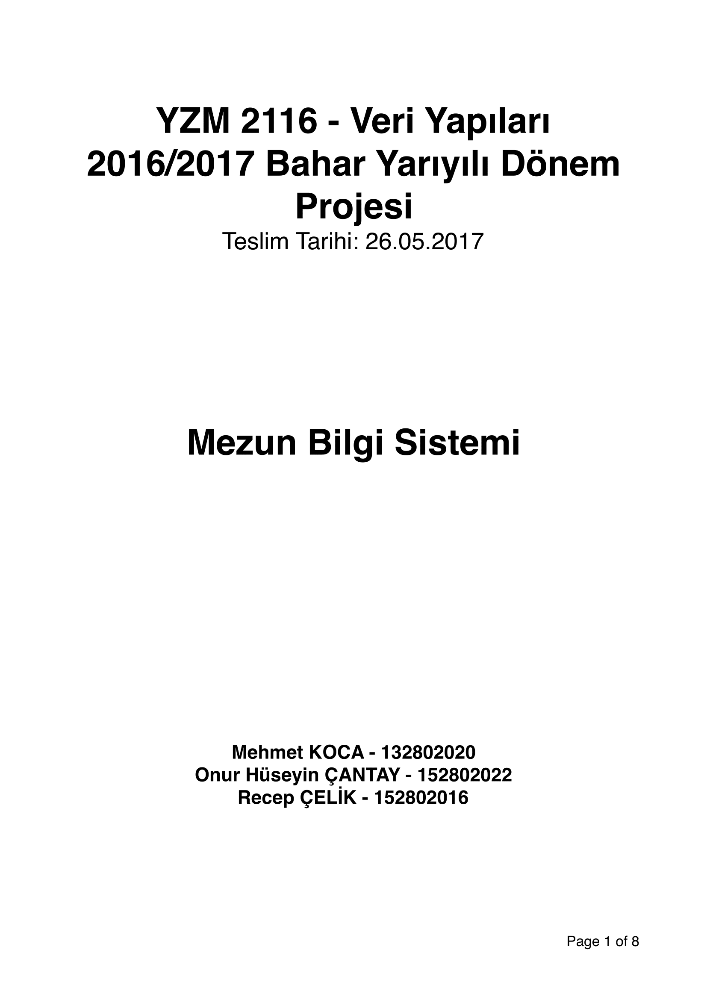
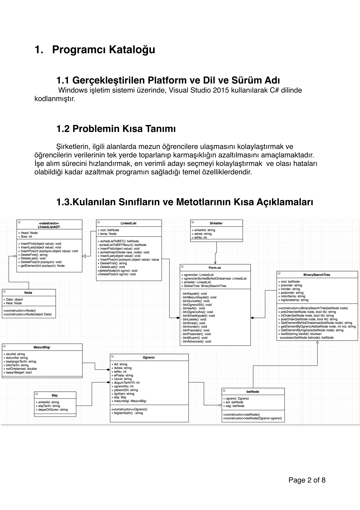
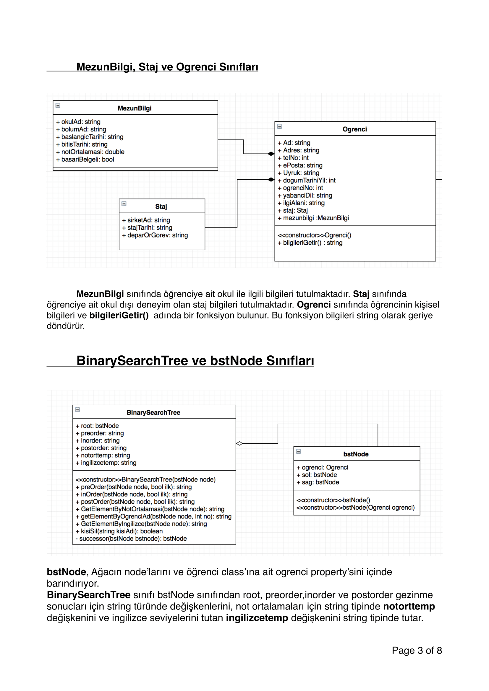
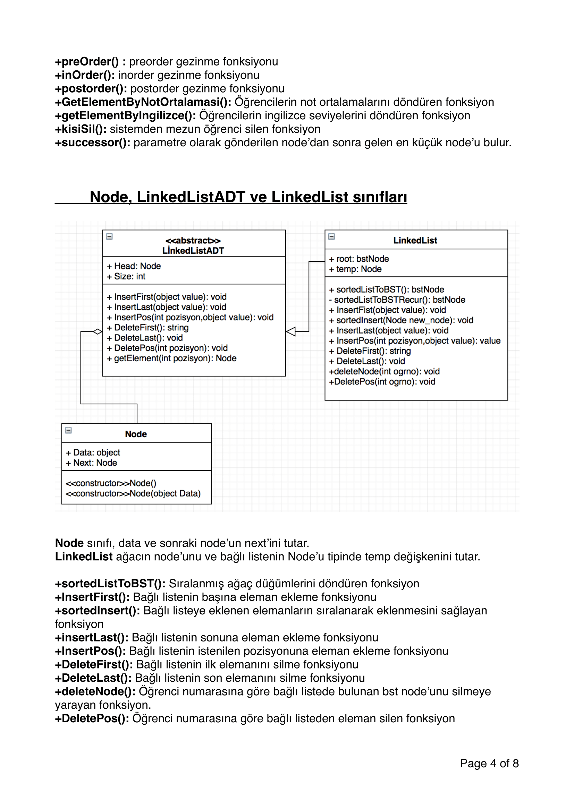
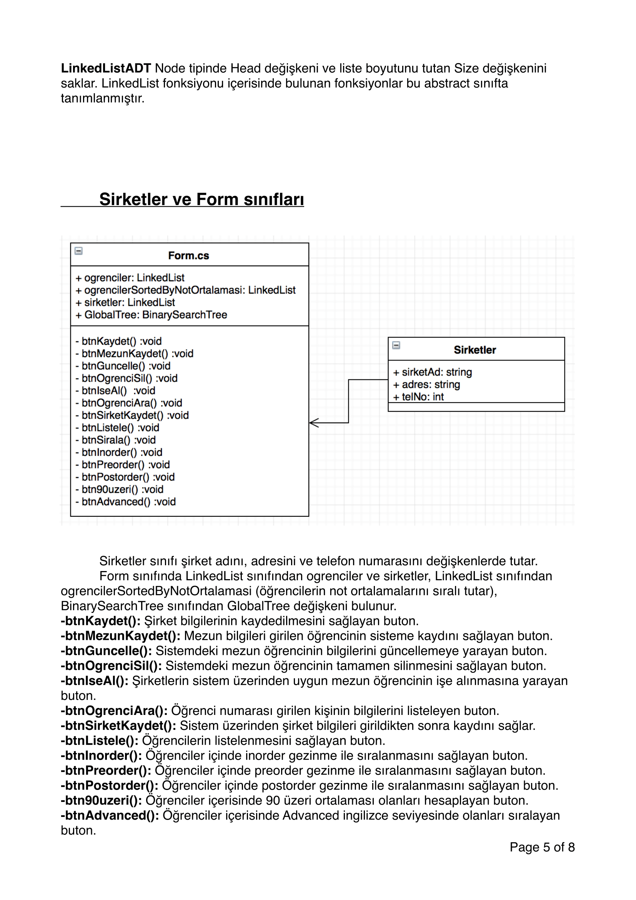
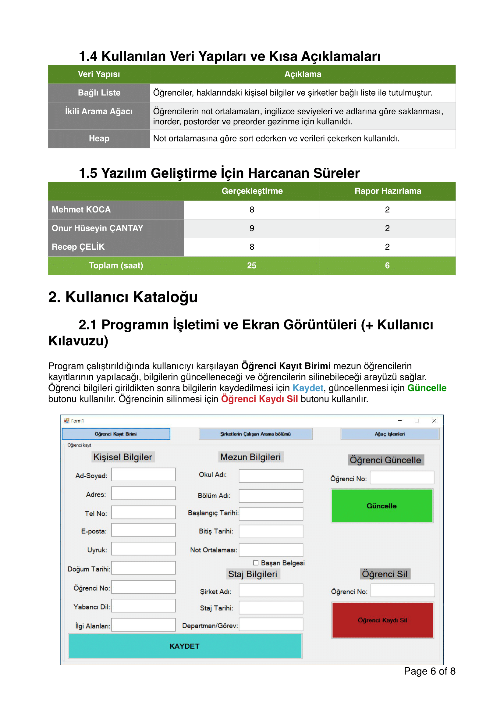
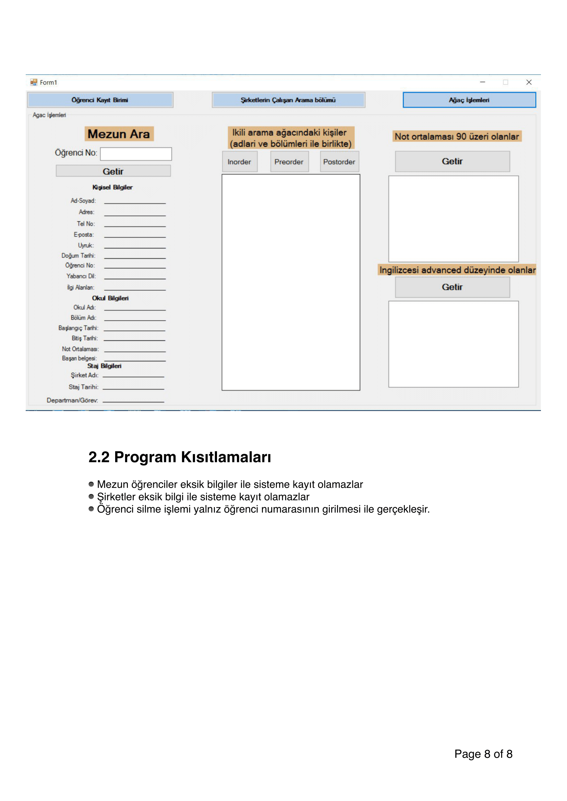

# Mezun-Bilgi-Sistemi

Bu projemizde Veri Yapıları Dersimizde gördüğümüz teknik bilgilerin uygulamasını gerçekleştirdik kullandığımız veri yapıları 
rapor üzerinde mevcuttur programın yapısı yine aynı şekilde raporda bulunmaktadır. 

**Contributor**
- [Mehmet KOCA](https://github.com/mehmetkoca)
- [Recep ÇELİK](https://github.com/Rexulon)

